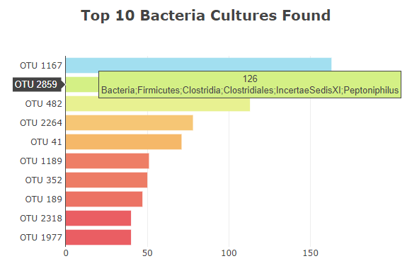
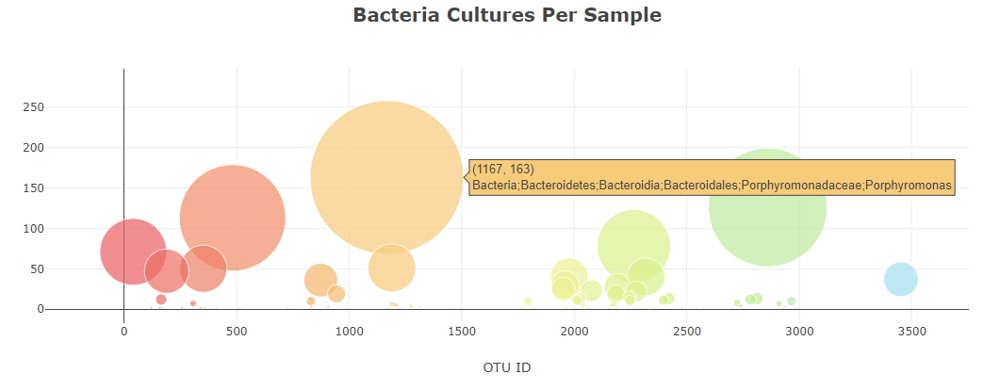
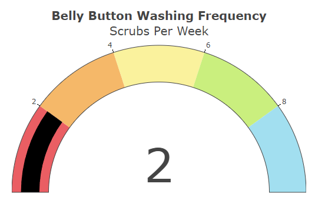
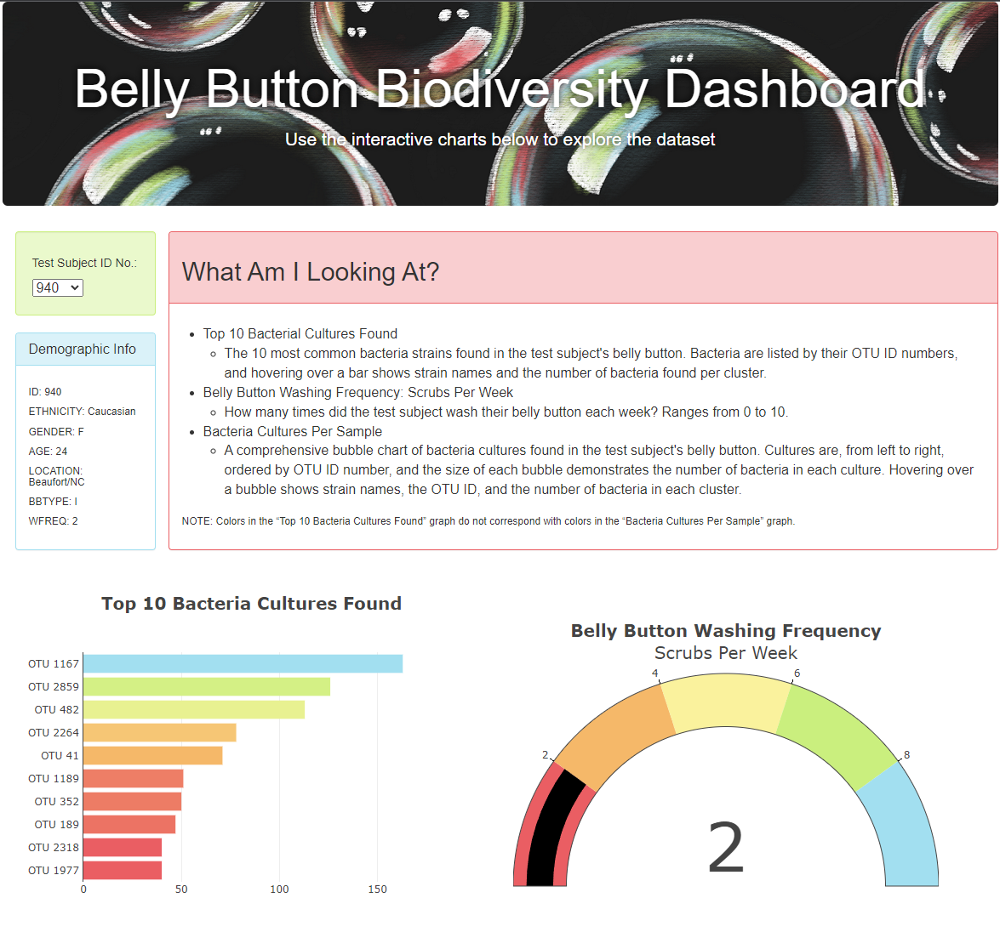

# Belly Button Biodiversity - Module 13 Challenge
UNC Chapel Hill Data Analytics Bootcamp

## Overview of Project
For Module 13, HTML, JavaScript, and Plotly were used to create a website displaying bacteria cultures found in test subjects' belly buttons. Given a json file containing test subjects' data, three visualizations were generated: a horizontal bar chart, bubble chart, and gauge chart. Users can also filter the results by test subject ID from a drop-down selector in the green panel.

## Method & Results
Before constructing any visualizations, the data in the given json was loaded with d3 and parsed to contain only the data of the given test subject. The default subject ID is number 940. When users change test subjects, the json is reloaded and variables are overwritten to focus on the new subject's data.

### Part 1 - Horizontal Bar Chart
The horizontal bar chart displays the top 10 bacteria cultures found in the test subject's belly button, in descending order. Bacteria are lsited by their OTU ID numbers, and hovering over a bar shows that strain's name(s) and the number of bacteria found from that cluster.

### Part 2 - Bubble Chart
The bubble chart shows all of the bacteria cultures found in the test subject's belly button. The cultures are ordered by their OTU ID number (from left to right), and the size of each bubble is relative to the amount of that bacteria in the sample. Hovering over a bubble shows the strain's name(s), OTU ID, and number of bacteris in the cluster.

### Part 3 - Gauge Chart
The gauge chart emphasizes how many times each test subject washes their belly button each week. Ranging from 0 to 10, this chart allows for easier understanding of the relationship between washing belly buttons regularly and the amount of bacteria in a belly button.

### Part 4 - Customization
To liven up the webpage from its initial design, a few changes were made. A background image was added to the jumbotron header, and the white text within was given a black shadow for easier readability. A panel explaining the purposes of the three charts was added to help users understand each element's purpose. All charts and panels on the page were also tailored to a custom colorset, creating a cohesive theme throughout.
The jumbotron background image is my own artwork; do not reuse without permission.

